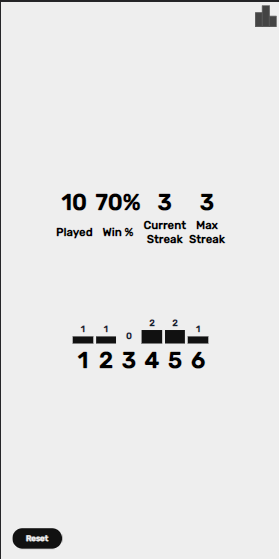

# WRDL

This is a fully functional [Wordle®](https://en.wikipedia.org/wiki/Wordle) clone written in vanilla JavaScript. It uses a local, client-side copy of the [*Official Scrabble® Players Dictionary*](https://scrabble.hasbro.com/en-us/tools) slimmed down to 5-letter words only, leaving 8636 words, a bit over 3x the official list. As this exposes many lesser-used words, and a free API to an unabridged dictionary was not available at the time of this writing, the endgame screen offers a link to the Wiktionary entry of the game's current word, which is successful most-if-not-all of the time. Statistics are saved to localstorage at this time.

[Deployed on Netlify](https://wrdl-with-restful-api.netlify.app/)

## Script Abstract:
1. Random word selection
1. Gameboard and keyboard generation
1. Binary search for valid entry on each guess
1. Evaluate guess and apply colors to DOM
1. Check for win condition and update DOM
1. Update statistics

## Screenshots

<figure>
<figcaption>Game Over: Shows link to definition</figcaption>

</figure>

<figure>
<figcaption>Statistics: Saved in localstorage</figcaption>

</figure>

## License

[CC BY 4.0](https://creativecommons.org/licenses/by/4.0/)